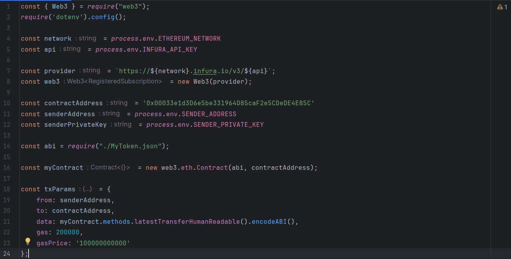

# ERC-20 TOKEN WITH WEB3.JS
WEB3.JS this is a library that allows you to interact with the functions of a smart contract
# Usage
ERC-20, which means "Ethereum Request for Comment 20," is the standard way tokens work on Ethereum. In our project, we used the Web3.js library to connect to Ethereum, where our ERC-20 token is already deployed. Then, we called the functions of this smart contract in our app.

## Main variables

## Install Dependencies:
npm install web3
npm install dotenv

## Create .env File:
ETHEREUM_NETWORK=<your_ethereum_network>
INFURA_API_KEY=<your_infura_api_key>
SENDER_ADDRESS=<your_ethereum_wallet_address>
SENDER_PRIVATE_KEY=<your_ethereum_wallet_private_key>

## Compile your solidity code:
Take ABI of your contract and create JSON file.

