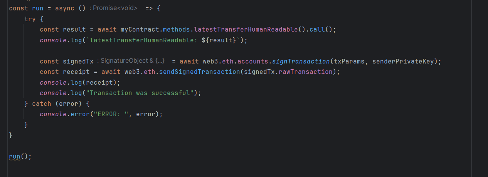
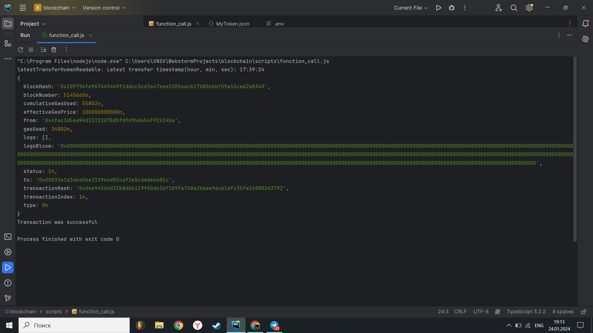

# ERC-20 TOKEN WITH WEB3.JS
WEB3.JS this is a library that allows you to interact with the functions of a smart contract
# Usage
ERC-20, which means "Ethereum Request for Comment 20," is the standard way tokens work on Ethereum. In our project, we used the Web3.js library to connect to Ethereum, where our ERC-20 token is already deployed. Then, we called the functions of this smart contract in our app.

## Main variables

## Install Dependencies:
npm install web3
npm install dotenv

## Create .env File:
ETHEREUM_NETWORK=<your_ethereum_network>
INFURA_API_KEY=<your_infura_api_key>
SENDER_ADDRESS=<your_ethereum_wallet_address>
SENDER_PRIVATE_KEY=<your_ethereum_wallet_private_key>

## Compile your solidity code:
Take ABI of your contract and create JSON file.

## Execution Script

## Output

# Example
Imagine Web3.js as a bridge between your wallet and the smart contracts living on a blockchain like Ethereum. It is a set of tools that allow you to:

1. Call Contract Functions: For example, you could call a function to buy tokens, transfer them to someone else, or even vote on a proposal within the contract.

2. Access Data: Web3.js lets you retrieve data stored within the smart contract. It could include details like who sent tokens to whom, the amount of sent and etc.

3.  Send Tokens via Web3.js: This is similar to making a payment, but using tokens instead of currency.

There are some functions:  latestTransferHumanReadable(), getTransactionSender(), getTransactionRetriever(), transfer(), balanceOf() and etc

